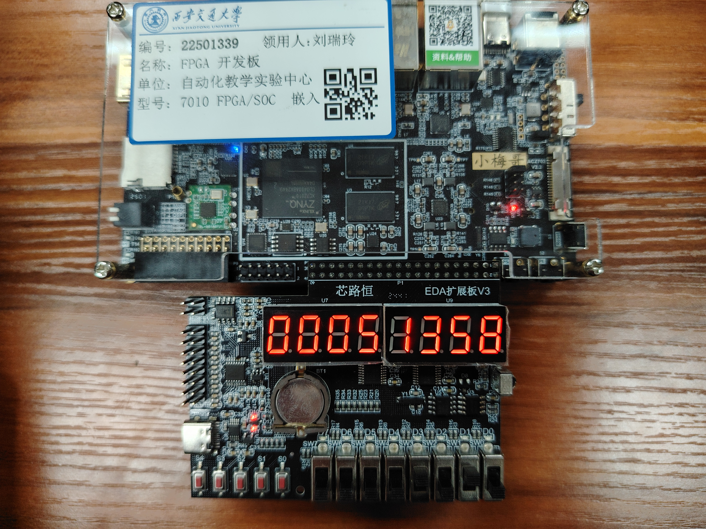
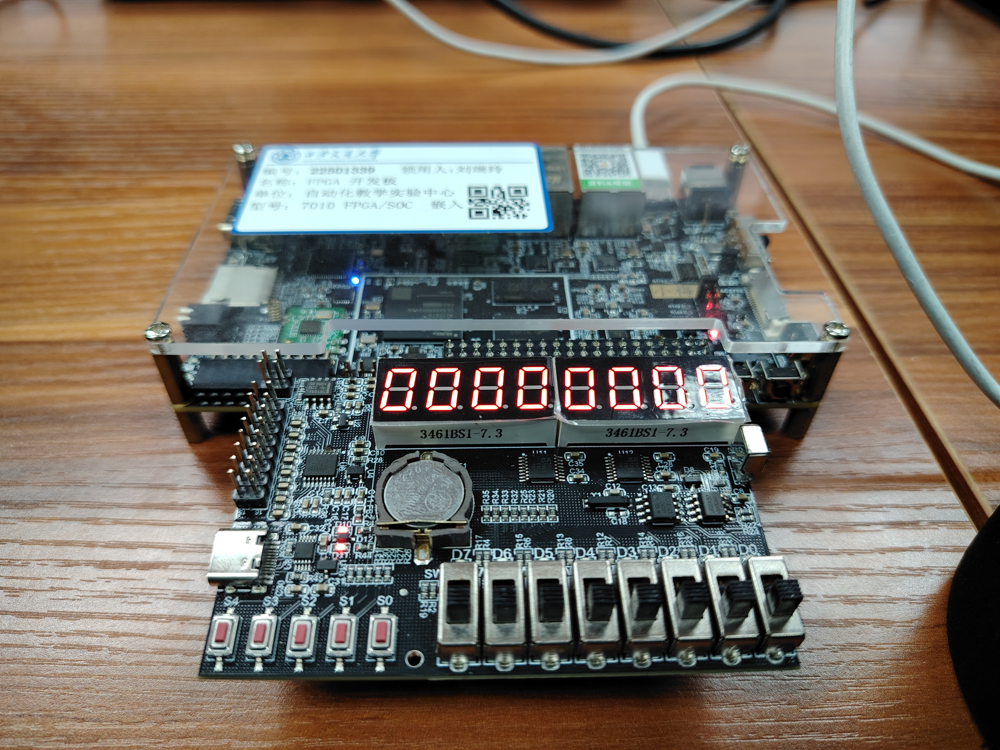

# 数字设计与计算机原理专题实验｜音乐播放器

## Design
- 对于音符长度固定（无法细分）、BPM固定的问题，设计了存储元信息的ROM，并更新了歌曲信息ROM的存储格式。具体来说，music_list_rom存储的是歌曲在music_rom中的开始、结束、BPM信息3个字段，music_rom存储的是音符序列的长度、八度、音名3个字段。
- 对于有连续相同音的曲子，播放起来这些相同音连在一起。改进方法是设计一个时限，对每个音符前（或后），在这个时限内表现为静音。但只使用固定比例（如1/16）会出现对全音符和二分音符间隔过长的问题；只使用固定时长又会导致短音符效果不佳甚至被完全跳过的问题。于是将两者结合，取两种计算方式的较小值作为断开间隔，达到了较好的效果。（这一改进是在上一改进基础上进行的，即单独存储音符时值，不再通过多个音符叠加来表示更长的音。）
- 增加了使用数码管显示当前歌曲以及音符序号的功能，便于查看和调试。

## 实现步骤
对于音符播放部分，首先实现基本的定长音符序列播放功能。通过维护当前时间、当前音符开始/上一音符结束时间戳以及指向ROM当前行号的变量来实现，其中当前时间初始化为0，每时钟周期加1。每次判断当前时间是否超过了当前音符开始时间加上音符时长，若是则将行数切换到下一行。如果行数超出了给定范围，则复位到起始位置。行数变量控制ROM读取，读取出的按二进制分位包括所在八度（0-8，4位）以及音名（A-G和休止，包含对应升调，4位）；将音名用case查表，得到基本周期，由于相邻八度对应音为倍频关系，故将最低八度内对应音的周期位右移即可得到当前音的周期；将计算得到的周期送入PWM波发生模块驱动无源蜂鸣器，即实现功能。

然后实现变长音符序列播放功能。在上述ROM中再加入表示时值的若干列，在读取时对应载入并替换原固定时长即可，另外由于希望拍频BPM可调，故仅加载相对时长（x分音符）。考虑到一般少有32分音符以下的，故采用8位定点数来表示，小数点位于首位之后。例如`10000000`表示全音符，`00110000`表示附点四分音符。读出后，根据预设BPM值按比例换算为相对时钟周期的绝对时长即可。

最后实现了多曲切换、循环、预设BPM功能。上面功能仅限一首歌曲，要加入多首歌曲，需再引入一个索引ROM来存储每首歌曲在主ROM中的元信息，具体包括第$i$首歌在主ROM中的开始、结束地址，以及歌曲元信息（本项目中仅包括BPM）。这样需再引入索引中的行号变量。在主循环中，当检测到输入歌曲编号变化时，切换索引ROM行号；据行号读出元信息后，加载对应歌曲边界变量及BPM，之后复位主ROM行号到当前歌曲起始即可。

除上述歌曲播放之外，还有快进/快退、暂停/恢复、数码管显示等。快进快退采用主ROM行号加减预设值的方式，若超边界则循环。暂停使用停止时间戳更新并停止PWM驱动无源蜂鸣器的方式。数码管显示采用一个将二进制整数转为字符数组然后对应载入数码管的方式，详见代码。

### 遇到的问题及解决
- 在换算音符相对时长到基于时钟周期的绝对时长时，涉及乘法运算。查找资料得知乘法在某些型号中可能占用多个时钟周期，导致可能出现音符的时长晚于频率得出。但实际上，音符的时长远大于2个时钟周期，因此将上一音符播放周期切换为当前音符时，即使切换频率先于切换时长，也不会引起人耳可闻的异常。
- 歌曲间切换部分出现了和上面这个问题类似的问题，但现象表现出来了。在主ROM最后一首歌的最后一个音符播放结束后的一两个时钟周期内，本该切换到该首歌的首个音符，但由于主ROM未使用部分都被设为0，而在最开始的版本中，判断当前时间是否超出当前音符使用的是`==`，此时将导致永远无法切换。更改为`>=`后解决问题。
- 实验过程中，发现按键以及拨码开关的高/低与输出0/1的关系较为混乱。实际上，实验用到的按键按下输出0，弹起输出1；拨码开关低位输出0，高位为1。代码中`music_gen`主模块的`reset_n`变量对应拨码开关低位为暂停，高位为播放；`list_index`变量对应拨码开关高位将索引ROM二进制对应位置为1；`back15s`, `forw15s`对应按键按下为快退/快进，高位为正常。

## Results
### Simulation
<figure>
	
	<figcaption>图1 仿真结果</figcaption>
</figure>

### Pictures & Videos
<figure>
	
	<figcaption>图2(a) 概览</figcaption>
</figure>
<figure>
	
	<figcaption>图2(b) 初始化</figcaption>
</figure>
<figure>
	<video controls src="README_assets/Compatibility.d/VID_20260617_160111.mp4">Failed to load the video.</video>
	<figcaption>视频1 《天空之城》</figcaption>
</figure>
<figure>
	<video controls src="README_assets/Compatibility.d/VID_20260617_160303.mp4">Failed to load the video.</video>
	<figcaption>视频2 《为世界之光》</figcaption>
</figure>
<figure>
	<video controls src="README_assets/VID_20260617_160740.mp4">Failed to load the video.</video>
	<figcaption>视频3 《梦中的婚礼》《出埃及记》</figcaption>
</figure>
<figure>
	<video controls src="README_assets/VID_20260617_161402.mp4">Failed to load the video.</video>
	<figcaption>视频4 《钢铁洪流进行曲》</figcaption>
</figure>
<figure>
	<video controls src="README_assets/VID_20260617_162104.mp4">Failed to load the video.</video>
	<figcaption>视频5 《千本桜》</figcaption>
</figure>

## Future Improvements
- 现在是全部分开相邻音符，可以改进为在in.txt中引入记号（例如，在需要和后一个音符分割的音符后加上斜杠/），使得能够控制在哪些音符间断开。
- 数码管两部分都有前缀0，可以改为不显示。
- 娱乐向：多个板子同时演奏来构造单无源蜂鸣器无法完成的复音效果。

## Problems & Debugging
- .coe文件不支持行末分号注释，AI提供的关于.coe文件格式的介绍有误。
- 用于ROM等IP核初始化的.coe文件在更新后，需要打开IP核、进行一些改动并重新保存，以使IP核真正更新。
- 各`reg`类型的变量需要初始化；无需依赖reset信号，可以使用等号初始化。
- 对于music_rom中最后一首歌（所有在end位置上是一个0长度音符的歌），它在循环播放时，首个音符在第2次及以后播放时会被吞掉。这可能是由于在。改进方法：在music_rom后加入一个有长度的休止符作为缓冲。

Easy debugging:
- 快进/快退可能超出当前歌曲区间乃至向下溢出，故需判断进退后的结果；
- Post-Synthesis/Implementation Simulation 非常慢（我的电脑上~10us/s，跑1s需要1天）
- 歌曲通常含有大量音符，故手动编写.coe文件已经十分复杂且易出错。我选择使用Python代码，将事先转写好的乐谱信息转换为.coe文本，再写入Vivado中。
